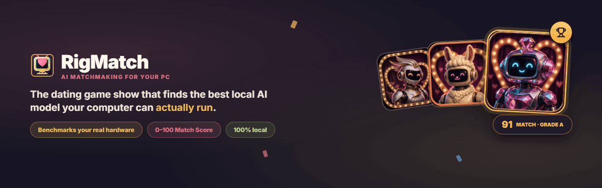
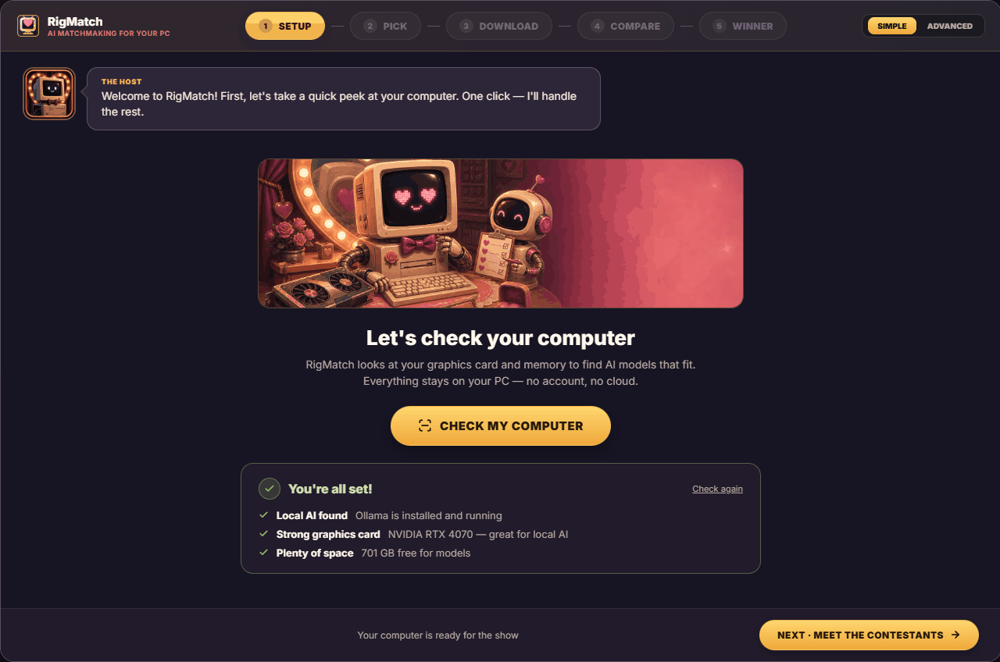
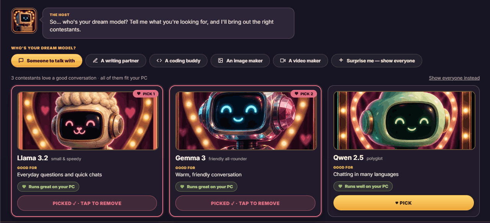
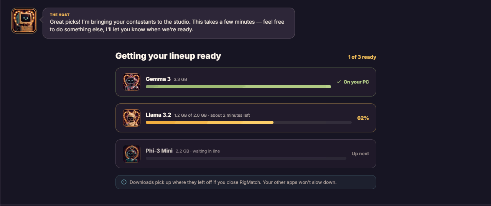
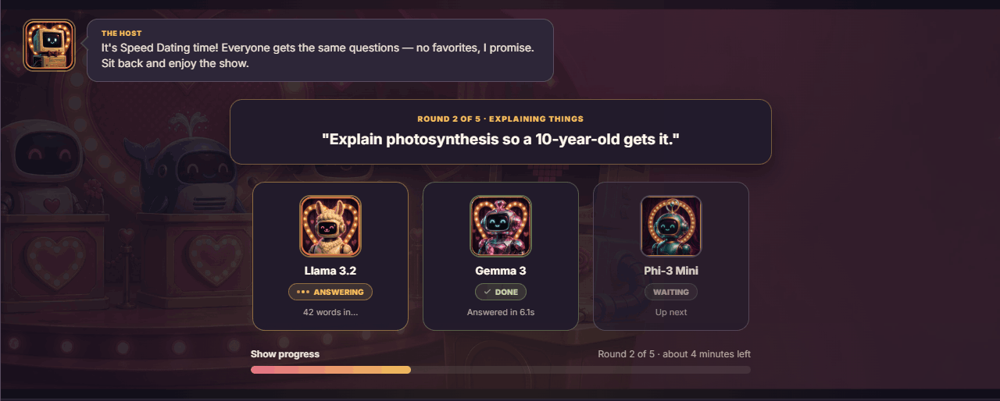
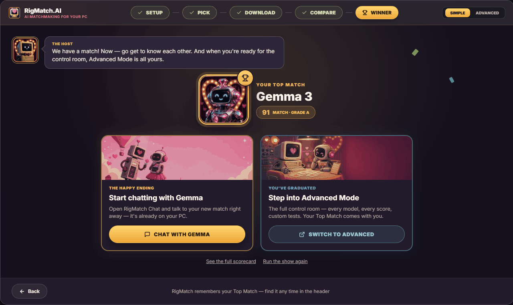

<p align="center">
  
</p>

<h1 align="center">RigMatch</h1>

<p align="center">
  <strong>Find the best local AI model your computer can <em>actually</em> run.</strong><br>
  A dating game show for your PC — models are contestants, benchmarks are speed dates, and the winner is your Top Match.
</p>

<p align="center">
  
  
  
  
  
  
</p>

---

## What is RigMatch?

Picking a local LLM is confusing: parameter counts, quantization, VRAM, context windows… RigMatch skips all of that. It **benchmarks models on your actual hardware** through [Ollama](https://ollama.com), scores each one on **speed, answer quality, and hardware fit**, and crowns a **Top Match** with a 0–100 Match Score.

Everything runs on your machine. No account, no cloud, no telemetry.

- 🖥️ **Reads your real rig** — GPU, VRAM, RAM, and disk decide which contestants even qualify
- 💛 **Speed Dating benchmarks** — every model answers the same questions, live on stage
- 🏆 **Match Score (0–100)** — one honest number: speed + quality + fit on *your* PC
- 🎨 **5 color themes** and illustrated contestant avatars for every model family

## Simple Mode — local AI for everyone

A five-step guided wizard for people who have never heard of VRAM and just want "the best AI for my PC." A game-show host walks you through the whole thing.

### 1 · Setup — check your computer

One click detects Ollama and reads your hardware — no jargon, just "you're all set."

<p align="center"></p>

<!-- Screenshots 2–5 are cropped to each step's stage: the header rail and
     footer repeat identically on every step, and a walkthrough that re-shows
     them makes the reader hunt for what changed (first outside review). -->

### 2 · Pick — meet the contestants

Tell the host who your dream model is — someone to talk with, a coding buddy, an image maker — and pick up to five contestants that fit your PC. One card per model; RigMatch picks the right size for your hardware.

<p align="center"></p>

### 3 · Download — the contestants arrive

Live progress while your lineup installs. Stop anytime; downloads resume if you close the app.

<p align="center"></p>

### 4 · Compare — Speed Dating, live on stage

Every contestant answers the same questions on the game-show stage. No favorites, live scores.

<p align="center"></p>

### 5 · Winner — your Top Match

The reveal: grade, plain-language scorecard, and two doors out — start chatting right away, or graduate to Advanced Mode.

<p align="center"></p>

## Advanced Mode

The full control room for power users: a dense sortable models table, custom test suites, diagnostics, logs, and per-run history. Your Top Match carries over.

## Getting started

1. **Install [Ollama](https://ollama.com/download)** and make sure it's running
2. **Download RigMatch** for your platform:

| Platform | Installer |
|---|---|
| Windows | `.exe` installer or `.zip` portable — [Releases](../../releases/latest) |
| macOS (Apple Silicon) | `.dmg` for M-series Macs — [Releases](../../releases/latest) |
| macOS (Intel) | `.dmg` for Intel Macs — [Releases](../../releases/latest) |
| Linux x64 | `.AppImage` or `.deb` for x64 Debian/Ubuntu — [Releases](../../releases/latest) |
| Linux ARM64 / Jetson | Experimental `.AppImage` or `.deb` for ARM64/aarch64 — [Releases](../../releases/latest) |

3. Launch it — Simple Mode will check your computer and take it from there

<details>
<summary><strong>macOS first-launch note</strong> (unsigned beta builds)</summary>

Rigmatch macOS downloads are unsigned beta builds distributed outside the App Store. On first launch, macOS may say the developer cannot be verified.

1. Download the correct `.dmg`: **mac-arm64** for Apple Silicon, **mac-x64** for Intel.
2. Open the `.dmg` and drag **Rigmatch** to **Applications**.
3. First launch only: right-click **Rigmatch.app**, choose **Open**, then **Open** again.
4. If macOS still blocks it, open **System Settings → Privacy & Security → Security** and choose **Open Anyway**.

If macOS says the app is **"damaged and can't be opened"** — and nothing appears
in Privacy & Security to let you open it anyway — run this once:

```bash
xattr -dr com.apple.quarantine "/Applications/RigMatch.app" && codesign --force --deep --sign - "/Applications/RigMatch.app"
```

Both halves matter on Apple Silicon. Clearing the quarantine flag alone is not
enough: an arm64 app will not launch unless its code signature validates, and
that is the part that was broken. The second command re-signs it locally.

This affects builds up to and including 0.4.2. Later releases sign themselves
during the build, so "damaged" should not appear at all — you may still see the
ordinary unidentified-developer prompt covered in the steps above.
</details>

<details>
<summary><strong>Linux &amp; Jetson note</strong></summary>

NVIDIA Jetson devices are usually **ARM64/aarch64** — use the Linux ARM64 artifact, not x64. Install the matching `.deb` through `apt` so dependencies resolve:

```bash
sudo apt update
sudo apt install ./Rigmatch-*-linux-*.deb
```

If apt reports missing desktop libraries, install the common Electron runtime dependencies:

```bash
sudo apt install libgtk-3-0 libnotify4 libnss3 libxss1 libxtst6 xdg-utils libatspi2.0-0 libuuid1 libsecret-1-0
```
</details>

### Build from source

```bash
git clone https://github.com/DaveEuson/Rigmatch.git
cd Rigmatch
npm install
npm run dev        # development
npm run build      # production build
```

## How the Match Score works

Each model runs the same question set on your hardware. The score blends:

| Ingredient | What it measures |
|---|---|
| ⚡ Speed | Tokens/sec and first-token latency on your rig |
| 🎯 Quality | Answer accuracy and usefulness across the test suite |
| 🧩 Fit | How comfortably the model sits in your VRAM/RAM |

The result is a 0–100 Match Score and a letter grade — one number you can trust, because it was measured on *your* machine, not a leaderboard's H100.

## Privacy

RigMatch is 100% local. Models run through Ollama on your hardware; nothing you type, test, or score ever leaves your computer.

## License

Source-available, not open source — see [LICENSE](LICENSE).

The code is published so you can read it and check what the app does, which is
the point of a privacy claim you can't otherwise verify. It does not grant
rights to copy, modify, or redistribute it. Using the released app is fine.

---

<p align="center"><sub>Made with 💛 and a retro-computer host. May your rig find its perfect match.</sub></p>
