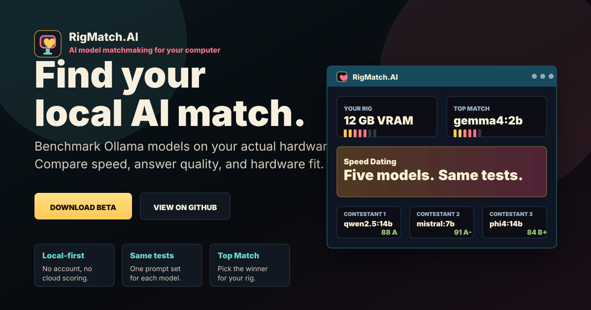
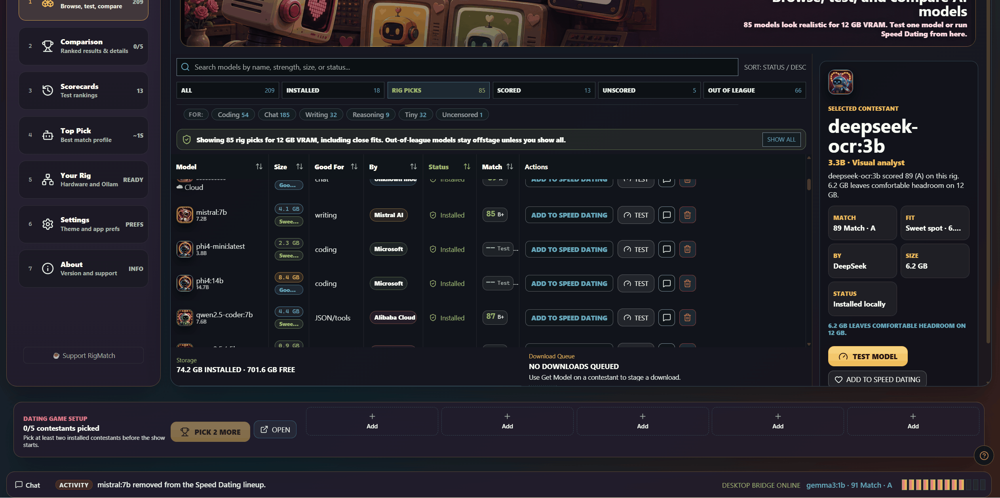
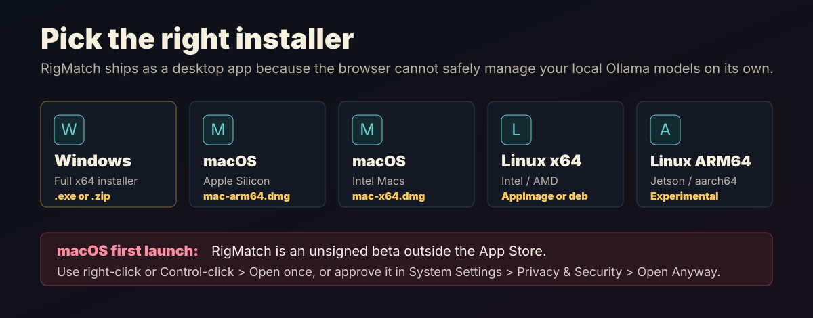
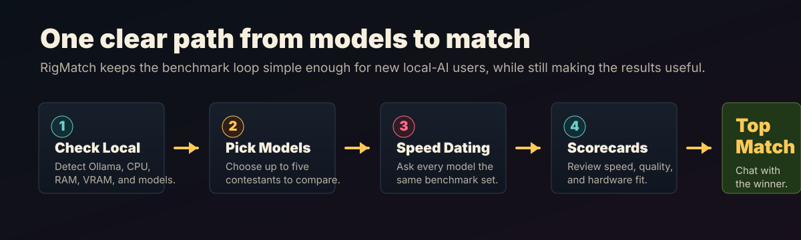
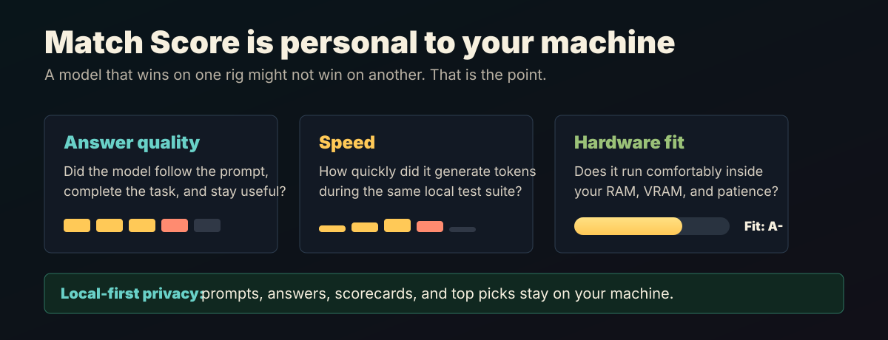
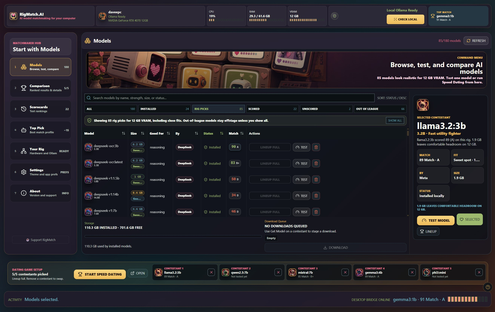
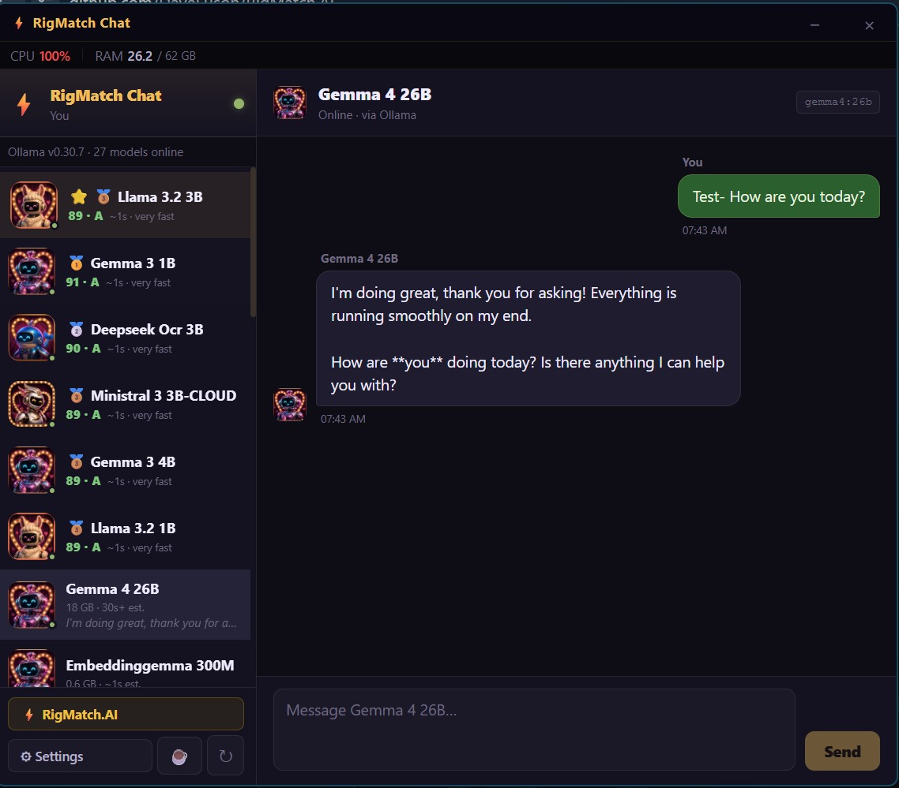

# RigMatch.AI

Find the best AI model your computer can run, 100% locally. RigMatch 0.3.x benchmarks through Ollama on your actual hardware — scored for speed, answer quality, and hardware fit — wrapped in a dating game show theme to make testing less boring.

<p align="center">
  
</p>

<p align="center">
  
</p>

## Download

**Beta v0.3.0** — [Downloads ->](../../releases/latest)

Nightly builds for upcoming fixes and previews are listed under [pre-releases](../../releases).

Want the quick overview first? Open the [RigMatch.AI demo/download page](https://daveeuson.github.io/RigMatch.AI/demo/).

<p align="center">
  
</p>

| Platform | Installer |
|---|---|
| Windows | `.exe` installer or `.zip` portable — [Releases page](../../releases/latest) |
| macOS Apple Silicon | `.dmg` for M-series Macs — see first launch note below — [Releases page](../../releases/latest) |
| macOS Intel | `.dmg` for Intel Macs — see first launch note below — [Releases page](../../releases/latest) |
| Linux x64 | `.AppImage` or `.deb` for x64 Debian/Ubuntu systems — [Releases page](../../releases/latest) |
| Linux ARM64 / Jetson | Experimental `.AppImage` or `.deb` for ARM64/aarch64 Ubuntu systems — [Releases page](../../releases/latest) |

### macOS first launch note

RigMatch.AI macOS downloads are unsigned beta builds distributed outside the App Store. On first launch, macOS may say the developer cannot be verified or that the app was downloaded from the internet.

1. Download the correct `.dmg`: **mac-arm64** for Apple Silicon/M-series Macs, **mac-x64** for Intel Macs.
2. Open the `.dmg` and drag **RigMatch.AI** to **Applications**.
3. First launch only: right-click or Control-click **RigMatch.AI.app**, choose **Open**, then choose **Open** again.
4. If macOS still blocks it, open **System Settings > Privacy & Security**, scroll to **Security**, and choose **Open Anyway** for RigMatch.AI.

After that first approval, RigMatch opens normally by double-clicking. If macOS says the app is damaged after copying it to Applications, run this Terminal command once:

```bash
xattr -cr /Applications/RigMatch.AI.app
```

### Linux and Jetson note

NVIDIA Jetson devices are usually **ARM64/aarch64**. Use the Linux ARM64 artifact, not the x64/amd64 package. Installing the wrong architecture can show confusing dependency errors in the Ubuntu installer.

For Ubuntu/Debian systems, install the matching `.deb` through `apt` so dependencies can be resolved:

```bash
sudo apt update
sudo apt install ./RigMatch.AI-*-linux-*.deb
```

If apt still reports missing desktop libraries, install the common Electron runtime dependencies:

```bash
sudo apt install libgtk-3-0 libnotify4 libnss3 libxss1 libxtst6 xdg-utils libatspi2.0-0 libuuid1 libsecret-1-0
```

## Quick Start

1. Install and start [Ollama](https://ollama.com), the current RigMatch test engine.
2. Download RigMatch.AI from the [Releases](../../releases) page and install it.
3. Open RigMatch and click **Check Local** — it will detect your Ollama setup.
4. Pick up to five models from the Models hub.
5. Click **Start Speed Dating** to run the benchmark.
6. Review the Scorecards and lock in your **Top Match**.
7. Open **RigMatch Chat** to talk to your winner.

<p align="center">
  
</p>

## What It Does

- Scans your machine (CPU, RAM, VRAM) and detects installed Ollama models
- Downloads models directly from the Ollama library
- Runs the same benchmark questions across every selected model, timed on your hardware
- Scores each model on answer quality, speed, and hardware fit
- Picks a **Top Match** for your specific rig
- Opens **RigMatch Chat** so you can talk to your top model right away

## Provider Support

RigMatch is **Ollama-first for downloads** and now detects **LM Studio** for models you already have locally.

| Provider | Status | Notes |
|---|---|---|
| Ollama | Supported now | RigMatch detects installed Ollama models, downloads from the Ollama library, and runs benchmarks through the local Ollama API. |
| LM Studio | Supported for local test/chat | Start LM Studio's local server, then click **Check Local**. RigMatch lists those models for testing and in-app chat through the OpenAI-compatible local API. The standalone RigMatch Chat companion stays Ollama-only for now. |
| OpenAI-compatible local servers | Partial | LM Studio's local OpenAI-compatible server is supported first. Broader provider configuration is still planned. |

### Can RigMatch use models I already downloaded in LM Studio?

Yes for testing and in-app chat, as long as LM Studio's local server is running. (The standalone RigMatch Chat companion is Ollama-only for now, so chatting with an LM Studio model happens in the main app.) LM Studio downloads are still managed by LM Studio; RigMatch does not delete, pause, or download LM Studio models.

If you want RigMatch's one-click catalog downloads, use Ollama. If you already have the model in LM Studio, start the LM Studio local server and click **Check Local**.

## How Scoring Works

RigMatch runs each selected model through the same local test suite on your actual hardware. Nothing is sent to a server.

The **Match Score** combines three signals:

- **Answer quality** — did the model follow the prompt and complete the task?
- **Speed** — how quickly it generated tokens on this machine
- **Hardware fit** — whether it runs comfortably within your RAM and VRAM

Scores are meant to compare models on *your* computer, not to claim a universal benchmark ranking. A model that scores 91 here might score differently on different hardware.

<p align="center">
  
</p>

## Privacy

Everything runs locally. No cloud, no account, no subscription. Your prompts and results never leave your machine.

## Screenshots

<p align="center">
  
  
</p>

## Requirements

### To use RigMatch

- [Ollama](https://ollama.com) installed and running locally; RigMatch 0.3.x uses Ollama as its test engine
- At least one Ollama model installed — or use RigMatch to download one
- Windows, macOS, or Linux


## How We Test RigMatch

RigMatch's benchmark score is only useful if it matches what Ollama actually returned. Before each beta release, test the scoring path from three angles:

```powershell
npm test
npm run lint
npm audit --audit-level=critical
npm --prefix rigmatch-chat audit --audit-level=high
npm run smoke:bench:strict -- --model qwen3:1.7b
npm run smoke:bench:strict -- --model mistral:7b
npm run compare:ollama-speed -- --model qwen3:1.7b
npm run build
```

- `npm test` runs fast unit/security checks for URL validation, model-name validation, installer guards, benchmark diagnostics, and scoring edge cases.
- `npm run lint` is a release gate; warnings should be reviewed, but generated bundles and Tauri target artifacts are intentionally ignored.
- `npm run smoke:bench:strict -- --model <model>` runs the real RigMatch benchmark prompt suite directly against local Ollama and fails if RigMatch-mode prompts return empty, truncated, or failed answers.
- The smoke test compares Ollama default mode with RigMatch mode. This catches thinking-model failures where Ollama spends all output tokens internally and returns no visible answer.
- RigMatch scored benchmarks send `think: false` when Ollama supports it, so models are graded on visible answers. If an older Ollama build rejects that field, RigMatch retries without it and logs the fallback.
- `npm run compare:ollama-speed -- --model <model>` checks raw Ollama generation timing against RigMatch parity timing.
- `npm run pack:win:local` creates a local Windows unpacked smoke build without trying to edit/sign the executable on machines without symlink privileges.

Recommended beta smoke models:

| Model | Why |
|---|---|
| `qwen3:1.7b` | Thinking-model regression check; previously exposed empty visible responses. |
| `mistral:7b` | Non-thinking 7B daily-driver canary with realistic answer length and speed. |
| One tiny local model | Optional quick sanity check; tiny models may legitimately truncate or score low. |

After packaging, install the generated build and manually smoke:

- Launch RigMatch.AI from the installed shortcut.
- Run **Check Local** and confirm Ollama/system info appears.
- Run a single model test and confirm the scorecard transcript saves answers.
- Run `qwen3:1.7b` and confirm repeated **NO RESPONSE** results do not return.
- Open **RigMatch Chat** from the main app.
- Start and cancel a model download.
- Close the app and confirm the model cleanup warning appears.

## Project Structure

Two apps ship together:

| App | Tech | Purpose |
|---|---|---|
| **RigMatch.AI** | Electron + React + TypeScript | Main matchmaking UI |
| **RigMatch Chat** | Tauri + React + TypeScript + Rust | Chat with your top model |

RigMatch Chat ships as a companion binary inside `companions/` and is launched from the match screen. It also runs standalone.

## Donationware

RigMatch.AI is free to use during beta.

If it helps you find a better local model, saves you time, or makes local AI less confusing — donations help cover code signing, testing hardware, builds, and artwork.

[buymeacoffee.com/daveeuson](https://buymeacoffee.com/daveeuson)

## Contributing

Issues and PRs welcome.

## Call for Artists

RigMatch uses illustrated contestant portraits for each AI model family (llama, gemma, mistral, phi, qwen, deepseek, and a generic fallback). The app has a dating-show aesthetic — portraits appear in the buddy list, profile modals, and chat header.

If you want to contribute avatar art, open an issue or email [daveeuson@gmail.com](mailto:daveeuson@gmail.com). Full style brief and family list available on request. Credit appears in the app's About page.
